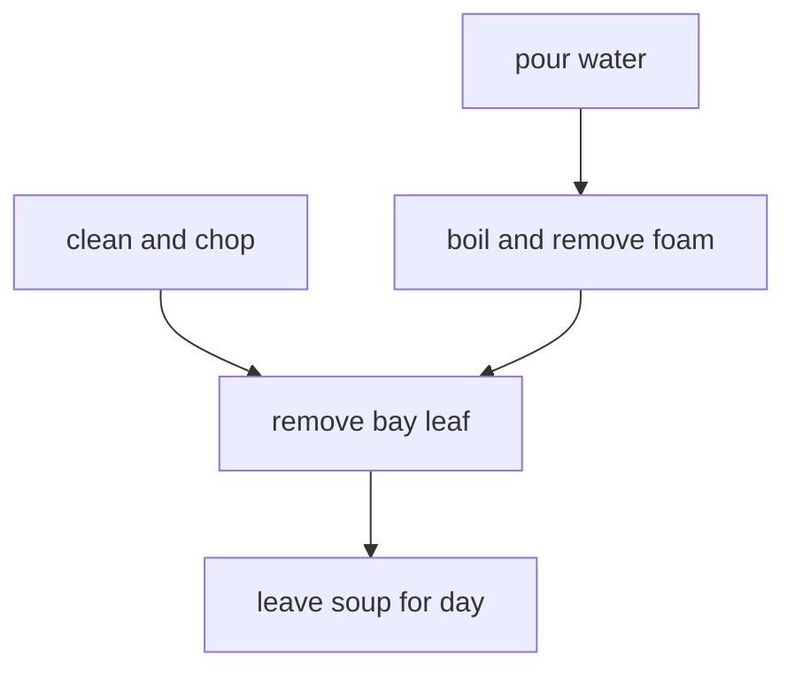
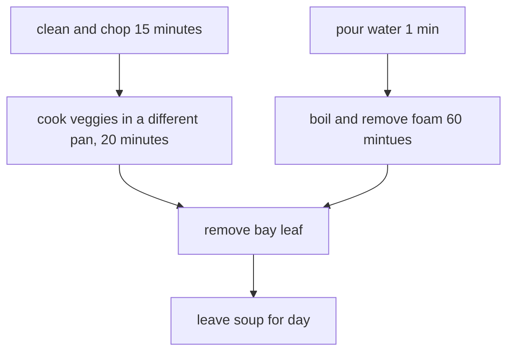
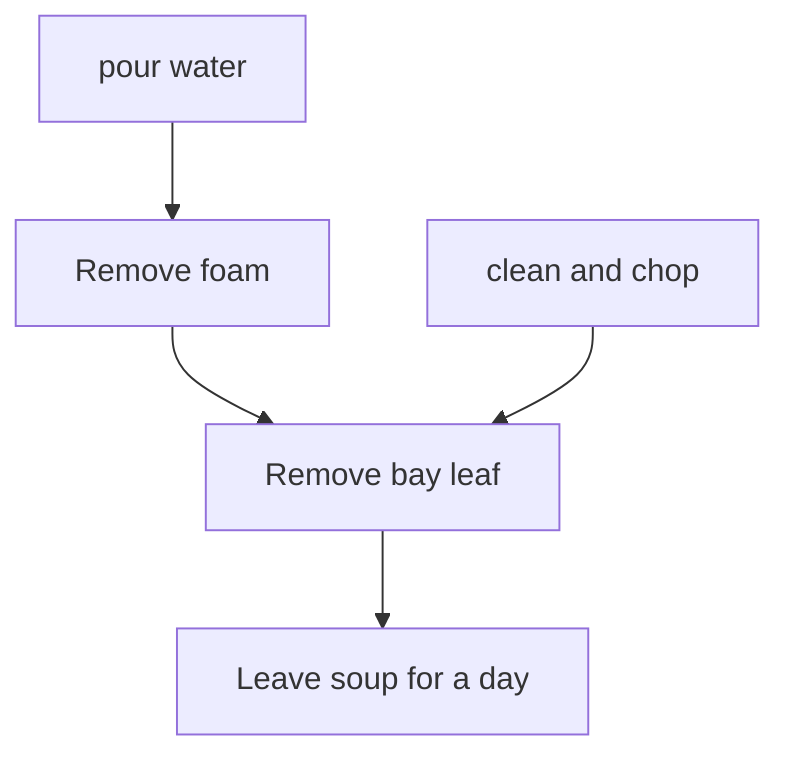

# 2021-04-12 Introduction to Parallel Programming in Python - Day 1

Welcome to The Workshop Collaborative Document 
 

This Document is synchronized as you type, so that everyone viewing this page sees the same text. This allows you to collaborate seamlessly on documents. 

All content is publicly available under the Creative Commons Attribution License 

https://creativecommons.org/licenses/by/4.0/ 

 ---------------------------------------------------------------------------- 

This is the Document for today: [link](https://hackmd.io/@O0tsDNPbTlyhyGiiCMaLIw/r1l9ohWSu)

Collaborative Document day 1: [link](https://hackmd.io/@O0tsDNPbTlyhyGiiCMaLIw/r1l9ohWSu)

Collaborative Document day 2: [link](https://hackmd.io/@O0tsDNPbTlyhyGiiCMaLIw/By912hbBd)
  

## 👮Code of Conduct 

* Participants are expected to follow those guidelines: 
* Use welcoming and inclusive language 
* Be respectful of different viewpoints and experiences 
* Gracefully accept constructive criticism 
* Focus on what is best for the community 
* Show courtesy and respect towards other community members 
 

## ⚖️ License 

All content is publicly available under the Creative Commons Attribution License: https://creativecommons.org/licenses/by/4.0/ 

 

## 🙋Getting help 
to ask a question, type `/hand` in the chat window 

to get help, type `/help` in the chat window 

you can ask questions in the document or chat window and helpers will try to help you 
 

## 🖥 Workshop website 

[Workshop website](https://escience-academy.github.io/2021-04-12-parallel-python/) 


🛠 Setup 

See workshop website

## 👩‍🏫👩‍💻🎓 Instructors 

Johan Hidding, Djura Smits
 

## 🧑‍🙋 Helpers 

Hanno Spreeuw, Leon Oostrum
 

## 🗓️ Agenda 

<div class="row">
  <div class="col-md-6">
    <h3>Day 1</h3>
    <table class="table table-striped">
      <tr> <td>09:00</td>  <td>Welcome and icebreaker</td> </tr>
      <tr> <td>09:15</td>  <td>Introduction</td></tr>
      <tr> <td>09:50</td>  <td>Break</td></tr>
      <tr> <td>10:00</td>  <td>Measuring performance</td> </tr>
      <tr> <td>10:50</td>  <td>Coffee break</td> </tr>
      <tr> <td>11:00</td>  <td>Computing Pi</td> </tr>
      <tr> <td>12:45</td>  <td>Wrap-up</td> </tr>
      <tr> <td>13:00</td>  <td>END</td></tr>
    </table>
  </div>
  <div class="col-md-6">
    <h3>Day 2</h3>
    <table class="table table-striped">
      <tr> <td>09:00</td>  <td>Welcome and icebreaker</td> </tr>
      <tr> <td>09:15</td>  <td>Recap</td> </tr>
      <tr> <td>09:30</td>  <td>Accelerate code using Numba</td> </tr>
      <tr> <td>10:30</td>  <td>Coffee break</td> </tr>
      <tr> <td>10:45</td>  <td>Parallel design patterns with Dask Bags</td> </tr>
      <tr> <td>11:45</td>  <td>Tea break</td> </tr>
      <tr> <td>12:00</td>  <td>Workflows with Snakemake</td></tr>
      <tr> <td>12:45</td>  <td>Post-workshop Survey</td> </tr>
      <tr> <td>13:00</td>  <td>END</td> </tr>
    </table>
  </div>
</div>
 

## 🧠 Collaborative Notes 

#### Introduction
What kind of problems did you encounter: “Why did you sign up?”

* Undestanding how to use threading and mul

le-core processing.
* Computational bottlenecks with large datasets
* Using supercomputing facilities with a python code, interested in parallelizing my code +1 :+1: :+1:
* Understanding parallel programming in python for when I inevitably need it :+1:
* Students are using python more and more on our HPC cluster(s) and have problems understanding how to use the resources (task, openmp, mpi, gpu). I would like to help them further.
* flexibility for big datasets
* I want to make more efficient use of our large core (>40) machines. 
* many bioinfomatics problems boil down to 10k-100k independent 'short' jobs or function calls.
* our forest model works with lots of independent forest plots over Europe, parallel processing might improve the efficiency of computing
* Write efficient and fast code in Python; learn tools / techniques to speed up existing code 
* Speed up python code to reduce switching between python and C and CUDA :+1:
* Speed up existing python code on large matrix calculations
* Speed up of large image processing algorithm
* Speed up of training machine learning models. +1

**Exercise. (5 min) Parallel and non-parallel**  
Can you think of a task in your domain that is parallelizable? Can you also think of one that is fundamentally non-parallelizable?

* bioinformatics: protein folding mainly non-parallelizable
* bioinformatics: annotation of DNA/protein sequences: highly parallel.
* computing models in a grid (where each model has a different set of input parameters, characterized by a gridpoint) - embarrassingly parallelizable
* mechanics: running different finite element analysis (FEA) for different designs (parallelizable) / some FEA simulations that depend on past FEA simulations (non-parallelizable)
* bioinformatics: genome assembly.
* Hydrological models are serial: step t+1 depends on the status of the system at step t. Uncertainty analysis can be parallelized running the same model multiple times in parallel
* Ice sheet models are serial as well - but can be parallised by paralelly computing grid points for each t_i
* Processing a dataset which is already split into N chunks is parallelizable. 
* Remote sensing for ecological applications: monitoring ecosystem structure change across different EU countries using same workflow can be parallelized.  
* astrophysics: (parallelizable) correlation/beamforming in radio interferometry
* parallelizable: sampling processes, kernel density estimation
* parallelizable: Different epochs during a training of an AI model / non-parallelizable: The epoch itself
* Computing: classifying individuals using an existing model is parallelizable. Building the models is (often) non parallelizable but depends on the algorithm.
* Trivial parallelization: computing checksums of millions of files to check data integrity. No-parallizable?: computing time-series of weather simullations
* Chemistry: assigning partial charges to atoms as opposed to computing molecular orbitals
* Atomic operations are not parallelizable. All other operations are. But what exactly is an atomic operation? Depends on the instructionset of the MCU/CPU I assume.
* parallizable:spatial convolutions
* FFT
* Monte Carlo Simulations: when you need the previous state to compute the next state - non parallelizable


**Exercise. (10 min) Parallelised Pea Soup**  
We have the following recipe:

1. (1 min) Pour water into a soup pan, add the split peas and bay leaf and bring it to boil.  
1. (60 min) Remove any foam using a skimmer and let it simmer under a lid r about 60 minutes.  
1. (15 min) Clean and chop the leek, celeriac, onion, carrot and potato.  
1. (20 min) Remove the bay leaf, add the vegetables and simmer for 20 more minutes. Stir the soup occasionally.  
1. (1 day) Leave the soup for one day. Reheat before serving and add a sliced smoked sausage (vegetarian options are also welcome). Season with pepper and salt.

Imagine you’re cooking alone.

Can you identify potential for parallelisation in this recipe?  
And what if you are cooking with the help of a friend help? Is the soup done any faster?  
Draw a dependency diagram.

- grp5:


- grp2:


grp3:
*thanks group 5 for the outline diagram!*



grp1: (Marjolein, Francesco, Scott, Cees)

Tasks:
1. (1 min) Pour water into a soup pan, add the split peas and bay leaf and bring it to boil.
2.    (60 min) Remove any foam using a skimmer and let it simmer under a lid r about 60 minutes.
3.    (15 min) Clean and chop the leek, celeriac, onion, carrot and potato.
4.    (20 min) Remove the bay leaf, add the vegetables and simmer for 20 more minutes. Stir the soup occasionally.
5.    (1 day) Leave the soup for one day. Reheat before serving and add a sliced smoked sausage (vegetarian options are also welcome). Season with pepper and salt.

Dependency diagram
```
1 -> 2 \
       +   4 -> 5
3      /
```

Optional division of additional tasks

1.    1a (1 min) Pour water into a soup pan,
2.    1b add the split peas and bay leaf
3.    1c bring it to boil.
4.    2a (60 min) Remove any foam using a skimmer
5. 2b    let it simmer under a lid r about 60 minutes.
6. 3a    (15 min) Clean the leek
7. 3b    chop the leek,
8. 3c    Clean celeriac
9. 3d    chop celeriac
10. 3e    Clean onion
1. 3f    chop carrot
2. 3g    clean potato
3. 3h    chop potato
4. 4    (20 min) Remove the bay leaf, add the vegetables and simmer for 20 more minutes. Stir the soup occasionally.
5. 5    (1 day) Leave the soup for one day. Reheat before serving and add a sliced smoked sausage (vegetarian options are also welcome). Season with pepper and salt.

Dependency diagram:
```
1a -> 1b -> 1c -> 2a -> 2b \
                           + 4 -> 5
3a -> 3b   +               /
3c -> 3d   +
3e -> 3f   +
3g -h 3h   +
```


grp4:
assuming removing foam is not continues process


grp 6:

Step 3 can be internally parallelized: different people chop different stuff in parallel


### Computing Pi

**Exercise (15 min) Implement an algorithm to compute π**

Use only standard Python and the function random.uniform. The function should have the following interface:

```python
import random

random.uniform(-1, 1)

def calc_pi(N):
    """Computes the value of pi using N random samples."""
    ...
    for i in range(N):
        # take a sample
        ...
    return 4 * M/N
```

Group 3:
```python
def calc_pi(N):
    """Computes the value of pi using N random samples """
    r = 1 # # set radius of circle
    M = 0 # initialise M
    for i in range(N):
        
        # n times well take a sample
        x = random.uniform(-r,r)
        y = random.uniform(-r,r)
        
        # circle; x^2 + y^2 = r^2
        if x**2 + y**2 < r**2:
            M += 1
        
    return 4*M/N

ourPi = calc_pi(100) # = 3.08
```

group 5:
```python
def calc_pi(N):
    """Computes the value of pi using N random samples."""
    
    M = 0
    
    for i in range(N):
        # take a sample
        x = random.uniform(-1, 1)
        y = random.uniform(-1, 1)
        
        temp = x**2 + y**2
        
        if temp <= 1:
            M += 1
        
    return 4 * M/N
```

**Exercise (5 min) Daskify**

Write calc_pi_dask to make the Numpy version parallel. Compare speed and memory performance with the Numpy version. NB: Remember that dask.array mimics the numpy API.

**Exercise (5 min) Numbify**

Create a Numba version of calc_pi. Time it.


**Tips/tops**

#### Tips
* Don't put us in breakout rooms if the solution is short and simple, we can work on them while staying in the main room. (saves some time)

#### Tops
* Taking some time to answer everyones questions
* Regular breaks

### Code transcript

#### Introduction
Serial:
```python
x = [1, 2, 3, 4] # Write input
y = 0 # Initialize output

for i in range(len(x)):
  y += x[i] # Add each element to the output variable

print(y) # Print output
```

Parallelisable:
```python
x = [1, 2, 4, 4]

chunk1 = x[:2]
chunk2 = x[2:]

sum_1 = sum(chunk1)
sum_2 = sum(chunk2)

result = sum_1 + sum_2

print(result)
```

Embarassingly parallel:
```python
y = [n**2 for n in x]
```

### Measuring Performance

```python
import dask
import numpy as np

result = np.arange(10**8).sum()

import dask.array as da
work = da.arange(10**8).sum()

result
work
type(work)

work.compute()
```

```python
%%time
result = np.arange(5*10**8).sum()
```

```python
%%time
work = da.arange(5*10**8).sum()
work.compute()
```

```python
%%timeit
result = np.arange(5*10**7).sum()
```

```python
time = %timeit -o np.arange(10**7).sum()
time.best
time.worst
```

```python
!pip install memory_profiler
from memory_profiler import memory_usage

def sum_with_numpy():
    np.arange(10**7).sum()
    
def sum_with_dask():
    work = da.arange(10**7).sum()
    work.compute()
    
memory_numpy = memory_usage(sum_with_numpy, interval=0.01)
memory_dask = memory_usage(sum_with_dask, interval=0.01)

import matplotlib.pyplot as plt

plt.plot(memory_numpy, label='numpy')
plt.plot(memory_dask, label='dask')
plt.xlabel('Time step')
plt.ylabel('Memory / MB')
plt.legend()
plt.show()
```

```python
import psutil
psutil.cpu_count(logical=True)
psutil.cpu_count(logical=False)
```

```python
x = []
for n in range(1, 9):
    time_taken = %timeit -r 1 -o da.arange(5*10**7).sum().compute(num_workers=n)
    x.append(time_taken.average)
    
import pandas as pd
data = pd.DataFrame({"n": range(1, 9), "t": x})
data.set_index("n").plot()
```


### Computing Pi

```python
import random

random.uniform(-1, 1)

def calc_pi(N):
    """Computes the value of pi using N random samples."""
    M = 0
    for i in range(N):
        # take a sample
        x = random.uniform(-1, 1)
        y = random.uniform(-1, 1)
        
        if x**2 + y**2 < 1.0:
            M += 1
            
    return 4 * M/N
    
calc_pi(100000)
```

```python
import numpy as np

def calc_pi_np(N):
    pts = np.random.uniform(-1, 1, (2, N))
    M = np.count_nonzero((pts ** 2).sum(axis=0) < 1.0)
    return 4 * M / N
    
calc_pi(100000)
```

```python
%timeit -r 1 calc_pi(10**7)
%timeit -r 1 calc_pi_np(10**7)
```

```python
from memory_profiler import memory_usage
import matplotlib.pyplot as plt

memory_numpy = memory_usage(lambda: calc_pi(10**7), interval=0.01)
memory_dask = memory_usage(lambda: calc_pi_np(10**7), interval=0.01)

plt.plot(memory_numpy, label='numpy')
plt.plot(memory_dask, label='dask')
plt.xlabel('Time step')
plt.ylabel('Memory / MB')
plt.legend()
plt.show()
```

```python
import dask.array as da

def calc_pi_dask(N):
    pts = da.random.uniform(-1, 1, (2, N))
    M = da.count_nonzero((pts ** 2).sum(axis=0) < 1.0)
    return (4 * M / N).compute()
    
calc_pi(100000)
```

```python
%timeit -r 1 calc_pi(10**7)
%timeit -r 1 calc_pi_np(10**7)
%timeit -r 1 calc_pi_da(10**7)
```

```python
import numba

@numba.jit
def sum_range_numba(a):
    x = 0
    for i in range(a):
        x += i
    return x

%timeit sum(range(10**8))
%timeit sum_range_numba(10**8)
```

```python
@numba.jit
def calc_pi_numba(N):
    """Computes the value of pi using N random samples."""
    M = 0
    for i in range(N):
        # take a sample
        x = random.uniform(-1, 1)
        y = random.uniform(-1, 1)
        
        if x**2 + y**2 < 1.0:
            M += 1
            
    return 4 * M/N
    
%timeit calc_pi_numba(10**7)
```

```python
import queue
import threading

# Number of times to execute calc_pi_numba
ncalc = 10
# Number of threads to launch
ncpus = 4
# Input values
input_range = [10**6] * ncalc

# We need to define a worker function that fetches jobs from the queue.
def worker(q):
    while True:
        try:
            x = q.get(block=False)
            print(calc_pi_numba(x), end=' ', flush=True)
        except queue.Empty:
            break
            
# Create the queue, and fill it with input values
work_queue = queue.Queue()
for n_samples in input_range:
    work_queue.put(n_samples)
    
# Create a number of threads
threads = [threading.Thread(target=worker, args=(work_queue, )) for i in range(ncpus)]
```

```python
%%time

# Start the threads
for t in threads:
    t.start()
    
# Wait until all of them are done
for t in threads:
    t.join()
    
print()
```

```python
@numba.jit(nogil=True, nopython=True)
def calc_pi_numba_nogil(N):
    """Computes the value of pi using N random samples."""
    M = 0
    for i in range(N):
        # take a sample
        x = random.uniform(-1, 1)
        y = random.uniform(-1, 1)
        
        if x**2 + y**2 < 1.0:
            M += 1
            
    return 4 * M/N
    
%timeit calc_pi_numba(10**7)
```

-----end of code transcript

 
## General questions 

## 📚 Resources 
- Digital Skills Workshops by the Netherlands eScience Center https://escience-academy.github.io

- Courses by SURFsara
https://www.surf.nl/en/training-courses-for-research

- Information about compiler used by numba, LLVM:
https://ww.llvm.org

- Python features supported by numba:
https://numba.pydata.org/numba-doc/dev/reference/pysupported.html